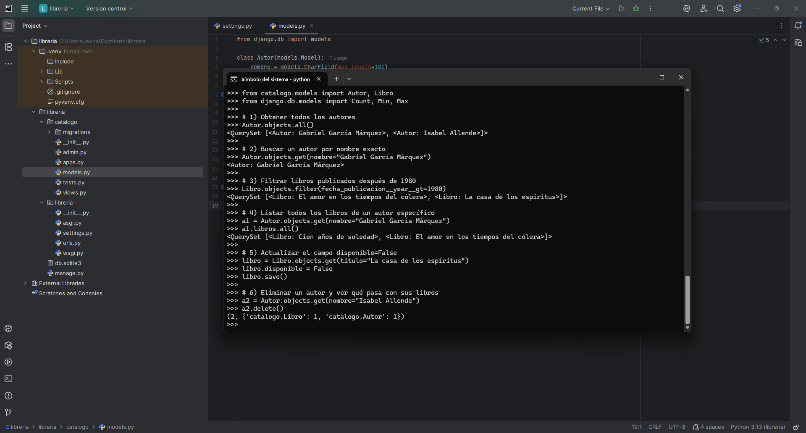
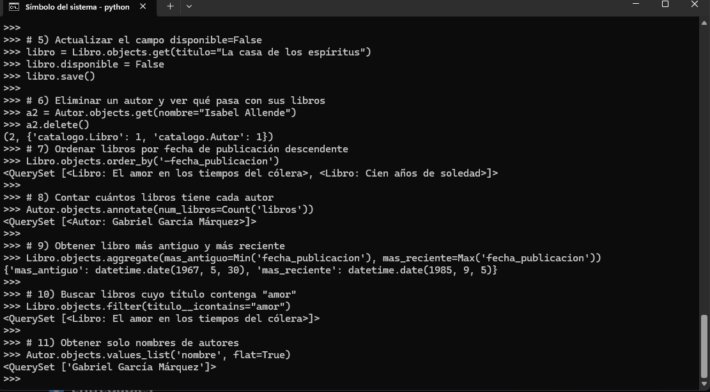

# Proyecto Django: Libreria

Este proyecto corresponde a la tarea práctica de **ORM en Django**, donde se crearon modelos de Autor y Libro, se realizaron migraciones, inserción de datos y consultas usando el ORM.

---

## Capturas de pantalla

Aquí se muestran las capturas de las consultas y resultados en el shell de Django:

---

## Preguntas

**¿Qué pasa con los libros al eliminar un autor?**  
Se borran automáticamente debido a `on_delete=models.CASCADE`.

**¿Qué ventajas tiene usar el ORM en lugar de SQL puro?**  
- Más fácil y rápido de usar.  
- Seguridad frente a inyecciones SQL.  
- Portabilidad entre distintas bases de datos.  
- Mantiene la integridad de los datos y facilita migraciones.
